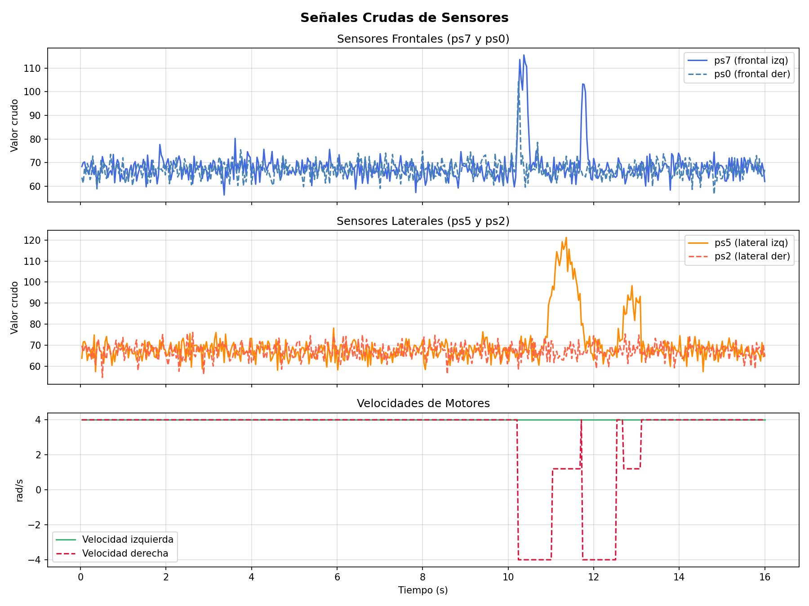
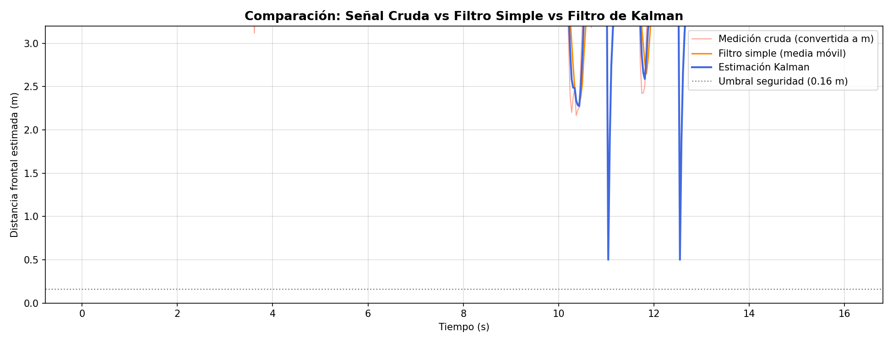
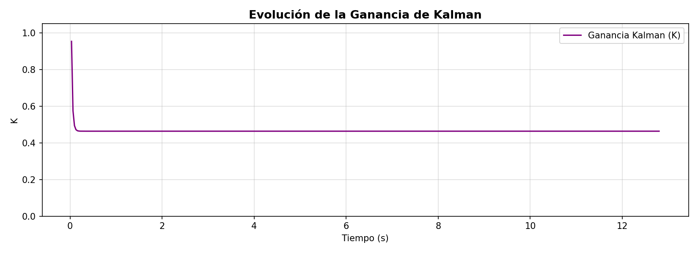
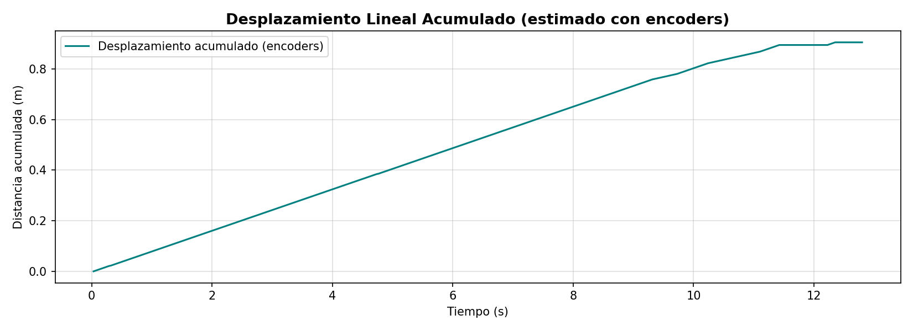

# Laboratorio 2 — Navegación Reactiva con Filtrado y Fusión de Sensores en Webots

**Asignatura:** ICI 4150 — Robótica y Sistemas Autónomos 2026-01  
**Integrantes:** Bresman Garzón Vargas · Julián Silva Donoso · Vicente Mery Arancibia

---

## Objetivo

Implementar un sistema básico de navegación reactiva en Webots para un robot móvil diferencial, aplicando filtrado sobre las mediciones de sensores de distancia y un filtro de Kalman para estimar la distancia frontal a obstáculos y mejorar la toma de decisiones.

---

## Robot y Sensores Utilizados

**Robot:** e-puck (Webots) — diferencial de dos ruedas.

| Sensor | ID Webots | Posición | Uso |
|--------|-----------|----------|-----|
| Proximidad frontal izquierdo | `ps7` | Frontal izq. | Detección de obstáculos al frente |
| Proximidad frontal derecho   | `ps0` | Frontal der. | Detección de obstáculos al frente |
| Proximidad lateral derecho   | `ps2` | Lateral der. | Decisión de dirección de giro |
| Proximidad lateral izquierdo | `ps5` | Lateral izq. | Decisión de dirección de giro |
| Encoder rueda izquierda      | `left wheel sensor`  | Rueda izq. | Estimación de avance |
| Encoder rueda derecha        | `right wheel sensor` | Rueda der. | Estimación de avance |

**Radio de rueda:** r = 0.0205 m

---

## Frecuencia de Muestreo

| Parámetro | Valor |
|-----------|-------|
| Tiempo de muestreo Ts | 0.064 s (64 ms, paso base del e-puck) |
| Frecuencia de muestreo fs | ≈ 15.6 Hz |
| Muestras registradas | [completar tras experimento] |

> Todas las señales registradas (crudas, filtradas y estimadas) fueron adquiridas con esta misma frecuencia.

---

## Estimación del Avance mediante Encoders

Los encoders entregan medidas angulares en radianes. El desplazamiento lineal de cada rueda se calcula con:

```
s = r · θ
```

El avance lineal del robot en cada ciclo es el promedio de ambas ruedas, excepto durante giros en el lugar (velocidades opuestas), en cuyo caso se considera avance nulo.

---

## Filtro Simple Aplicado

Se implementó un **filtro de media móvil** de ventana N = 5 muestras sobre la lectura frontal convertida a metros. Esto suaviza los picos de ruido del sensor antes de pasarla como medición al filtro de Kalman.

```python
def media_movil(buffer, nuevo_valor, ventana):
    buffer.append(nuevo_valor)
    if len(buffer) > ventana:
        buffer.pop(0)
    return sum(buffer) / len(buffer)
```

---

## Filtro de Kalman — Implementación

### Variable estimada
Distancia frontal al obstáculo más cercano: **d̂ₖ** (metros).

### Parámetros

| Parámetro | Símbolo | Valor |
|-----------|---------|-------|
| Estado inicial | d̂₀ | 0.5 m |
| Covarianza inicial | P₀ | 1.0 |
| Varianza del sensor | R | 0.05 |
| Varianza del proceso | Q | 0.02 |

### Etapa de Predicción (encoders)

```
d̂⁻ₖ = d̂ₖ₋₁ − Δdₖ
P⁻ₖ = Pₖ₋₁ + Q
```

donde Δdₖ es el avance estimado del robot en el ciclo k.

### Etapa de Corrección (sensor frontal)

```
Kₖ = P⁻ₖ / (P⁻ₖ + R)
d̂ₖ = d̂⁻ₖ + Kₖ · (zₖ − d̂⁻ₖ)
Pₖ = (1 − Kₖ) · P⁻ₖ
```

donde zₖ es la distancia en metros calculada a partir del sensor frontal.

---

## Lógica de Navegación Reactiva

| Condición | Acción |
|-----------|--------|
| d̂ₖ < 0.16 m **o** sensor frontal crudo > 100 | Girar (mínimo 25 ciclos) |
| Sensor lateral izquierdo > 80 | Curvar suavemente a la derecha |
| Sensor lateral derecho > 80 | Curvar suavemente a la izquierda |
| Vía libre | Avanzar a velocidad base |

**Elección del lado de giro:** si el lateral izquierdo (ps5) detecta más obstáculo que el derecho (ps2), el robot gira a la derecha, y viceversa.

---

## Resultados por Escenario

### Escenario 1 — Entorno simple (pocos obstáculos)
[-]
<video src="https://github.com/user-attachments/assets/d08adcfc-bf0e-4a4e-9dd8-2a4ad316326d" controls width="600">
Para el primer escenario, con seis paredes se hizo un pasillo estrecho con el objetivo de que el robot evualuase qué hacer al llegar al final del mismo.

1. **Estabilidad del movimiento**: El movimiento fue constante durante la simulación.
2. **Cantidad de giros innecesarios**:0
3. **Capacidad para evitar colisiones**:Alta, en ningún momento se observó una colisión.

## Gráficos de Señales

### Señales crudas de sensores

- El primer gráfico representa los sensores frontales Ps7 y Ps0, tienen su punto más alto al final de la simulación cuando el robot se encuentra con la pared.
- El segundo gráfico representa los sensores laterales Ps2 y Ps5, estos detectan paredes a lo largo del camino. Al llegar al final, detecta una colisión a la izquierda, por lo que ajusta la velocidad de las ruedas, luego detecta una colisión a la derecha y hace el mismo proceso.
- El tercer gráfico representa la velocidad de las ruedas, las cuales al activarse los sensores laterales ajusta la velocidad de las ruedas, dimsinuyendo la velocidad de una de las dos para girar o invirtiendo la velocidad de una de las ruedas para rotar al robot. 

### Comparación: crudo vs filtro simple vs Kalman

- El gráfico presenta la medición cruda, con fitro simple y con filtro Kalman.
- El filtro Kalman estima el estado del robot, por lo que en su punto más alto que es cuando el robot se encuentra encerrado, procede a moverse y corregir su curso para evitar la colisión.
- En color naranja se encuentran los datos con un filtro simple intentando limpiar un poco el ruido de los sensores, presentan un comportamiento más inestable que el Kalman.


### Evolución de la ganancia de Kalman

- La ganancia de Kalman determina qué valor tomar en cuenta, si a los encoders en las ruedas o a los sensores, con el fin de estimar el estado del robot de la forma más fidedigna debido al ruido externo. Pero al ser una simulación "perfecta", esta converge de inmediato y se mantiene constante.

### Desplazamiento acumulado (encoders)

- El gráfico presenta el desplazamiento del robot a lo largo del tiempo, el cuál es casi lineal a excepción de las ocaciones en las que tiene que rotar. 

---
### Escenario 2 — Entorno complejo (pasillos o múltiples obstáculos)
[-]
<video src="https://github.com/user-attachments/assets/d8278d30-cc0f-499c-b648-7c1a0feabfb0" controls width="600">
Para el siguiente escenario propusimos un entorno un poco más complicado, teniendo cinco obstáculos separados entre ellos con el objetivo de evaluar el comportamiento del robot con desplazamiento libre. 

1. **Estabilidad del movimiento**: El movimiento tuvo un momento en el que se detuvo por un giro inncecesario.
2. **Cantidad de giros innecesarios**: 2.
3. **Capacidad para evitar colisiones**: Media, hubo una colisión no detectada.

## Gráficos de Señales

### Señales crudas de sensores

- El primer gráfico representa los sensores frontales Ps7 y Ps0, teniendo su punto más alto al detectar una colisión.
- El segundo gráfico representa los sensores laterales Ps2 y Ps5, estos detectan paredes a lo largo del mapa, teniendo sus puntos más altos cuando una pared está lo suficientemente cerca. En el punto más alto hubo una colisión que, junto a un error en las físicas de la simulación registró un valor muy alto que no generó un movimiento en el robot, como se puede ver en la imagen.

  


- El tercer gráfico representa la velocidad de las ruedas, las cuales al activarse los sensores laterales ajusta la velocidad de las ruedas, dimsinuyendo la velocidad de una de las dos para girar o invirtiendo la velocidad de una de las ruedas para rotar al robot. 

### Comparación: crudo vs filtro simple vs Kalman

- El gráfico presenta la medición cruda, con fitro simple y con filtro Kalman.
- El filtro Kalman estima el estado del robot, por lo que en su punto más alto que es cuando el robot se encuentra encerrado, procede a moverse y corregir su curso para evitar la colisión.
- En color naranja se encuentran los datos con un filtro simple intentando limpiar un poco el ruido de los sensores, presentan un comportamiento más inestable que el Kalman.

### Evolución de la ganancia de Kalman

- La ganancia de Kalman determina qué valor tomar en cuenta, si a los encoders en las ruedas o a los sensores, con el fin de estimar el estado del robot de la forma más fidedigna debido al ruido externo. Pero al ser una simulación "perfecta", esta converge de inmediato y se mantiene constante.

### Desplazamiento acumulado (encoders)

- El gráfico presenta el desplazamiento del robot a lo largo del tiempo, el cuál es casi lineal a excepción de las ocaciones en las que tiene que rotar. 

---

## Instrucciones para Ejecutar la Simulación

1. Abrir Webots y cargar el mundo `lab-2.wbt` o `mapa-simple.wbt`.
2. Asignar `prueba-simple.py` como controlador del robot e-puck.
3. Iniciar la simulación.
4. Al finalizar, se genera `señales_robot.csv` en la carpeta del controlador.
5. Ejecutar el script de graficación:
   ```bash
   pip install pandas matplotlib
   python graficar_señales.py
   ```
6. Los gráficos PNG se guardan en la misma carpeta.
